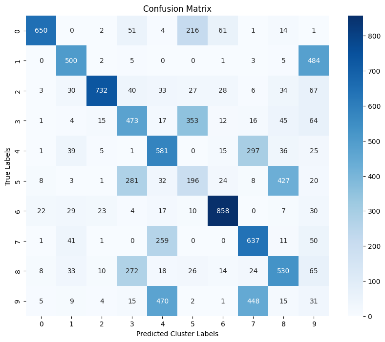
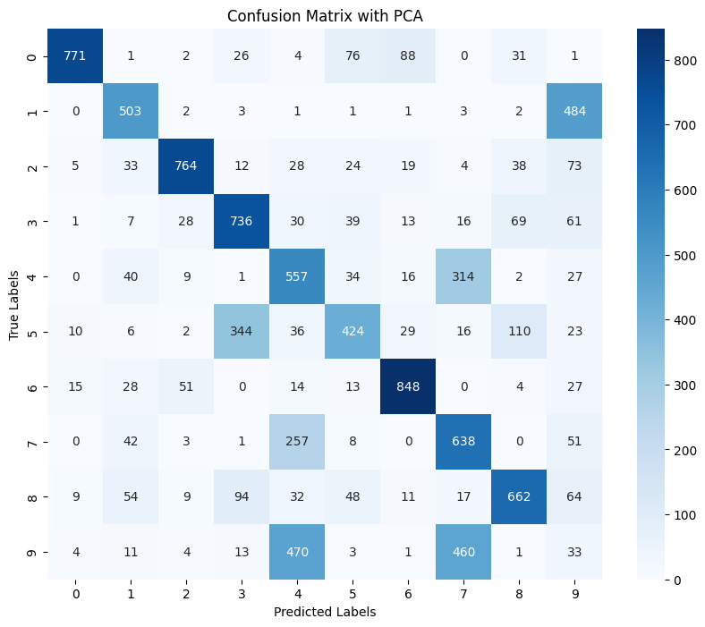

# Hypothesis
We expect that k-means clustering on PCA and feature vectors will improve clustering performance compared to using raw feature vectors. PCA removes noise and emphasizes the most critical dimensions of the data, leading to better-defined clusters. However, if too much information is lost during dimensionality reduction, clustering might perform poorly.

## Results

Table below presents the cluster purity values for different approaches:

| Method | Cluster Purity |
|--------|---------------|
| k-means without autoencoder (Q1) | 0.5670 |
| k-means on autoencoder feature vectors | 0.5798 |
| k-means on PCA-reduced feature vectors | 0.6387 |

## Observations and Analysis
The results support the hypothesis that using an autoencoder improves clustering performance over k-means in Q1. The cluster purity slightly increased from **0.5670** to **0.5798** when k-means was applied to the autoencoder's feature vectors. This improvement suggests that the autoencoder learned a latent space that better represents the digit structure, making clustering easier.

Moreover, applying PCA to the feature vectors significantly improved cluster purity to **0.6387**. This aligns with the hypothesis that PCA removes noise and focuses on the most essential dimensions, leading to better clustering. The confusion matrix in this case was also less noisy compared to the one obtained in Q1, indicating that more digits were correctly grouped.

However, there is a tradeoff: if too much dimensionality reduction were applied, essential information might be lost, leading to reduced clustering performance. The improvement observed in this experiment suggests that the PCA parameters were set appropriately to retain useful features while removing redundant information.

## Comparison with K means clustering without AE and PCA
Compared to the simple k means clustering model, where k-means was applied directly to the raw image data, using the autoencoder’s feature vectors improved clustering performance. This is because the autoencoder compresses the high-dimensional pixel data into a meaningful latent space, capturing key structures and reducing noise. The additional step of PCA further refined this representation by removing less significant variations, leading to an even more structured clustering result.

Previously, without autoencoder and pca, the confusion matrix was more scattered, indicating poor clustering of certain digits (higher digits, like 7, 8, or 9). In contrast, using autoencoder-based features and PCA helped separate the digit classes more effectively, as reflected in the improved cluster purity.

## Conclusion
The experiment demonstrates that using an autoencoder followed by PCA improves k-means clustering performance compared to applying k-means directly on raw images. The results align with the hypothesis, showing that feature extraction and dimensionality reduction can enhance clustering quality. These findings suggest that combining deep learning techniques with traditional clustering methods can be a powerful approach for unsupervised learning tasks.

